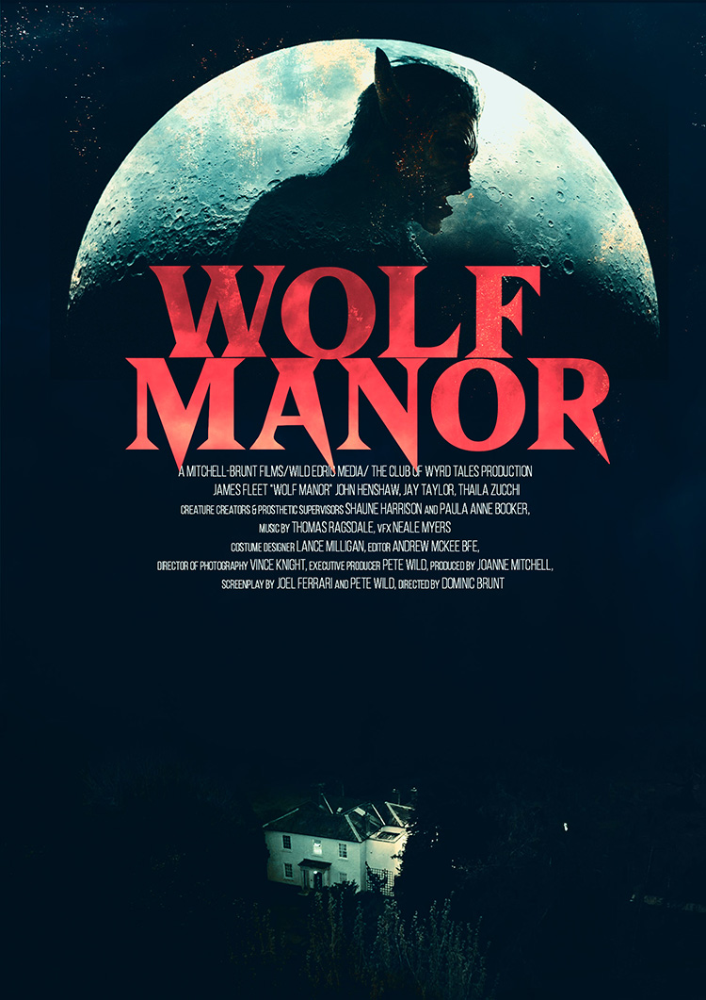

> Screened at Grimmfest's _Monsters & Movies_ event in Manchester, November 2022.

Horror comedy is a hard sell for me. Comedy in general is a hard sell, if I'm honest.
I like funny films but I don't like it when I can feel somebody _trying_ to be funny at me.
It's a very, very fine distinction and a line that's hard to walk it.

_Wolf Manor_ struggles to get it right. There are times when it's hilarious: a reporter stumbling
through the door, guts hanging out of his mouth and gurgling nonsense, being met with a round of,
"What did he say? Something about a wolf?" is very funny. Likewise the moment when our aging
thespian Oliver idly produces hundreds of foam balls from a cheap Cups And Balls magic set while
holding a conversation, or the first half of the final confrontation when he ineffectively beats the
beast around the head and body with a cane, in a sequence reminiscent of the Don't Stop Me Now scene in
_Shaun Of The Dead_.

The rest of it falls flat, unfortunately. Very few members of the film crew shooting a campy horror movie
in a spooky old manor are sympathetic characters, but they're also not horrible enough that we're actively
rooting for their deaths. The jokes are reached for hard and don't work, and the performances on display
are largely not good enough to carry it; they're too wooden, too obviously actors reading lines rather
than embodying roles. It's got a feeling of soap opera to it.

And it's a shame, because when it's good it's good. The best performances come from Sade Malone and
Martin Portlock (Ellie/'Boom' and Owen/'FX' respectively) who are both natural and believable and have
a ton of chemistry during the brief scenes they share together. Their screen time is disappointingly
short, but I hope we'll see more of Malone especially in future.

The core story - film crew shooting a vampire movie in a house that turns out to be the home of a
werewolf - is solid, but the execution is lacking. At one point Oliver (James Fleet) tells us,
"Nobody cares about backstory" - a sentiment proven accurate by the needless ten minute long
post-credits sequence showing the origin of the werewolf, the existence of which perfectly sums up
the problems of the movie. The film wants to be something it isn't, and doesn't ever know what it
really is.

Verdict: Not for me.
